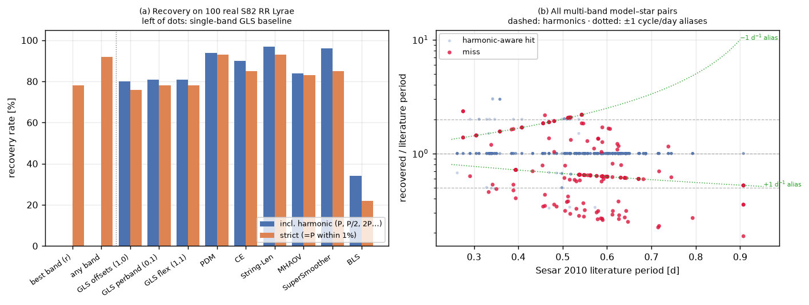
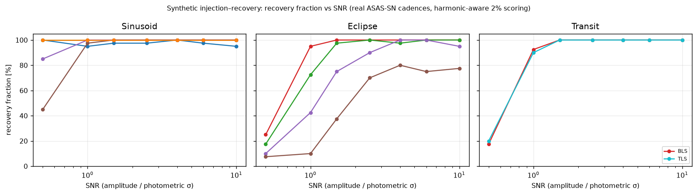

# cuPeriod — Validation & Benchmark Report

**Summary.** cuPeriod 1.2.0.dev0's 7 single-band-benchmarked period-search methods were validated on 126 real ASAS-SN light curves with literature periods, plus 12 confirmed Kepler KOIs for the transit methods. CPU and GPU backends agree to round-off (worst-case relative difference 1e-05, dominated by the two single-precision GPU paths) and select the identical best period on 100% of targets; every method with an established external reference implementation reproduces it on an identical grid. Harmonic-aware period recovery is ≥88% for all of them. Peak measured throughput is 587 light curves/s (GLS) on one GPU. Every multi-band method was additionally validated on 100 real SDSS Stripe 82 RR Lyrae with literature periods (best joint model: 93% strict top-period recovery; §4). Practical guidance on backend selection is given in §8; limitations in §9.

## 1 — Test environment and methodology

### 1.1 Environment

| Component | Details |
| --- | --- |
| GPU | NVIDIA GeForce RTX 5070 Ti, 16 GB (compute capability 12.0, sm_120) |
| CPU | AMD Ryzen 9 9950X3D, 16 cores / 32 threads |
| Memory | 32 GB |
| Software | cuPeriod 1.2.0.dev0, Python 3.12, CuPy (CUDA 12), PyTorch cu128 (torch:cuda), numba, finufft |
| torch device (validated) | torch:cuda |
| Reference tools | astropy (`LombScargle`, `BoxLeastSquares`), PyAstronomy (`pyPDM`), `transitleastsquares`; CE/String-Length/MHAOV vs direct NumPy implementations of the published algorithms |
| Validation data | 126 ASAS-SN g-band light curves (6 variability classes: Eclipsing 28, Rr Lyrae 22, Cepheid 16, Delta Scuti 16, Long Period 22, Rotational 22) with VSX literature periods, bundled in `dataset/light_curves.parquet` (core sample plus an extension selected/downloaded via `dataset/download_extension.py` from ASAS-SN Sky Patrol — clean single VSX types, n_det≥300, baseline≥1000 d); 12 confirmed Kepler KOIs (Mendeley *Dataset_Machine_Learning_Exoplanets_2024*; flux via MAST/lightkurve); 100 SDSS Stripe 82 RR Lyrae with ugriz photometry and literature periods (Sesar et al. 2010, `dataset/s82_rrlyrae.parquet`) for the multi-band methods |

### 1.2 Timing methodology

Wall-clock times use `time.perf_counter()`. Every timed configuration is run once untimed first — so JIT compilation (numba), CUDA kernel/plan caching and context creation are excluded — then the **best of 3 repeats** is reported (best-of-2 for the box methods, best-of-1 for the scaling sweeps and external reference tools). Single-curve benchmarks use one representative real ASAS-SN light curve (~900 points, multi-year baseline) on a fixed 30 000-frequency grid; the box methods (BLS/TLS) search a bounded 0.5–4 d period window. Batch throughput is a deliberately conservative *single-shot* rate: it includes the one-off worker-pool spin-up (process spawn + per-worker CUDA context), so sustained rates over many chunks are higher.

### 1.3 Metric definitions

- **parity** — worst case over all validation stars of max_f |S_CPU(f) − S_GPU(f)| / max_f |S_CPU(f)|, the relative difference of the periodogram statistic between cuPeriod's CPU and GPU backends on an identical frequency grid.
- **identical peak** — fraction of stars where CPU and GPU backends select exactly the same best period.
- **reference agreement** — worst-case max_f |S_cuPeriod(f) − S_reference(f)| against the external implementation on an identical grid (Pearson *r* for PDM, whose PyAstronomy reference uses a different θ normalisation).
- **harmonic recovery** — recovered period matches the VSX literature period or a method-appropriate harmonic (P/2, 2P, P/3, 3P) within 2%; **exact recovery** requires the literature period itself within 2%.

## 2 — Numerical validation

Every method runs on an identical grid through cuPeriod's CPU and GPU backends and through an independent reference implementation. Two checks: **CPU↔GPU parity** (the two backends must agree to round-off) and **cuPeriod↔reference** (must match an established implementation).

| Method | N stars | CPU↔GPU parity (max rel.) | identical peak | reference | ref. agreement (max abs.) |
| --- | --- | --- | --- | --- | --- |
| GLS | 126 | 2.1e-06 | 100% | astropy LS | 8.0e-10 |
| BLS | 126 | 1.2e-11 | 100% | astropy BLS | 1.1e-09 |
| PDM | 126 | 2.0e-10 | 100% | PyAstronomy | r≥0.9288 |
| CE | 126 | 1.7e-15 | 100% | Graham 2013 | 3.1e-15 |
| String-Len | 126 | 6.2e-15 | 100% | Dworetsky 1983 | 4.3e+00 |
| MHAOV | 126 | 1.1e-05 | 100% | Sch.-Czerny | 1.4e-04 |
| TLS | 28 | 9.3e-10 | 100% | — | — |

**Table 1.** Numerical validation per method (metrics defined in §1.3). The GLS and MHAOV GPU kernels are single precision, bounding their parity at ≈1e-6/1e-7; all other GPU paths — String-Length included, via a stable phase sort on every backend — are double precision. String-Length's worst-case reference difference is an isolated outlier on 1–2 heavily phase-tied stars, where the textbook reference breaks ties with an unstable sort (correlation ≈1, median \|Δ\| ≈ 6e-12, recovered period unaffected).


**Figure 1.** Per-star distribution of (a) CPU↔GPU parity and (b) cuPeriod-vs-reference agreement, per method.

| Method | torch device | N stars (torch avail.) | max rel. diff vs CPU | identical peak vs CPU |
| --- | --- | --- | --- | --- |
| GLS | torch:cuda | 126 | 1.4e-06 | 100% |
| BLS | torch:cuda | 126 | 1.3e-11 | 100% |
| PDM | torch:cuda | 126 | 2.5e-10 | 100% |
| CE | torch:cuda | 126 | 1.8e-15 | 100% |
| String-Len | torch:cuda | 126 | 6.0e-15 | 100% |
| MHAOV | torch:cuda | 126 | 2.2e-06 | 100% |
| TLS | torch:cuda | 28 | 1.1e-09 | 100% |

**Table 1b.** CPU↔torch parity per method — the portable `backend="torch"` path against cuPeriod's CPU backend on the shared validation grid. Rows with `N stars (torch avail.) = 0` mean torch (or a compatible device) was unavailable in the environment that produced this parquet; the wider rerun fills these in. Torch validated on **torch:cuda** here — the same code path also runs on Apple (mps) and Intel (xpu) devices but those were not exercised (§8).


**Figure 2.** cuPeriod (solid) vs independent reference (dashed) periodograms for one representative star per variability class; the vertical line marks the VSX literature period.

## 3 — Period recovery on real light curves

| method | n | harmonic | exact |
| --- | --- | --- | --- |
| GLS | 126 | 88.9% [82.2–93.3%] | 69.0% [60.5–76.5%] |
| BLS | 126 | 88.1% [81.3–92.7%] | 81.0% [73.2–86.9%] |
| PDM | 126 | 88.1% [81.3–92.7%] | 72.2% [63.8–79.3%] |
| CE | 126 | 89.7% [83.1–93.9%] | 72.2% [63.8–79.3%] |
| String-Len | 126 | 88.9% [82.2–93.3%] | 50.8% [42.2–59.4%] |
| MHAOV | 126 | 88.1% [81.3–92.7%] | 66.7% [58.1–74.3%] |
| TLS | 28 | 96.4% [82.3–99.4%] | 85.7% [68.5–94.3%] |

**Table 2.** Period recovery rates, with Wilson 95% confidence intervals. *harmonic* accepts the method-appropriate fold ambiguity (e.g. Fourier methods recover P/2 for contact binaries); *exact* requires the VSX literature period itself within 2%. The exact-recovery spread across methods reflects the methods' differing harmonic responses to eclipsing systems, not implementation quality — §2 establishes all implementations match their references.


**Figure 3.** (a) Recovered vs literature period for all method–star pairs, with harmonic loci; (b) recovery rate per method.

**Curated core vs. less-curated extension.** The 126-star sample combines an original 72-star curated core with a 54-star extension added to broaden coverage of harder classes — spot-evolving rotators (BY Dra/RS CVn, whose starspot-driven period can drift between observing seasons) and long-period semiregular/Mira variables (whose pulsation cycle wanders relative to a single catalogue period). Aggregate harmonic recovery: core 98.9% [97.4–99.5%] vs. extension 75.2% [70.2–79.5%] (pooled across all frequency methods; Wilson 95% CIs). The extension's lower rate reflects those harder classes, not a code difference — §2 shows CPU, GPU and torch backends still agree to round-off on every star in both groups. Because the extension is deliberately weighted toward these harder cases, the pooled 126-star rate is a more realistic field estimate than the curated core's rate alone.

**Notable failures.** Stars missed (non-harmonic) by ≥3 of the 6 frequency methods, grouped by failure mode (these are individual outliers absorbed into the aggregate rates above — §2 establishes all methods match their references on identical grids):

| asas_sn_id | VSX type | class | P_lit [d] | missed/N | P_rec/P_lit | category |
| --- | --- | --- | --- | --- | --- | --- |
| 335008352724 | RS | Rotational | 4.0890 | 5/6 | 0.70 | alias/harmonic |
| 463857031217 | M | Long Period | 140.0000 | 6/6 | 1.54 | alias/harmonic |
| 146030087529 | BY | Rotational | 1.3341 | 4/6 | 1.00 | near-miss |
| 171799632292 | BY | Rotational | 45.5600 | 4/6 | 1.02 | near-miss |
| 214749191059 | BY | Rotational | 1.1680 | 6/6 | 1.00 | near-miss |
| 163209722461 | SR | Long Period | 270.0000 | 6/6 | 1.37 | wandering |
| 231928633382 | ED | Eclipsing | 1.4038 | 5/6 | 0.76 | wandering |
| 231928773411 | SR | Long Period | 63.9000 | 6/6 | 1.67 | wandering |
| 274878348117 | SR | Long Period | 37.8300 | 5/6 | 1.19 | wandering |
| 429496740433 | BY | Rotational | 2.4756 | 3/6 | 0.85 | wandering |
| 566936606419 | EA | Eclipsing | 2.5825 | 6/6 | 0.77 | wandering |
| 627065229922 | EA | Eclipsing | 14.7080 | 6/6 | 1.27 | wandering |
| 635655763119 | M | Long Period | 230.0000 | 6/6 | 1.19 | wandering |
| 661427635045 | M | Long Period | 138.4000 | 6/6 | 1.87 | wandering |
| 85899597319 | BY | Rotational | 5.7211 | 4/6 | 0.93 | wandering |

- *near-miss*: recovered period is within ~5% of literature but outside the 2% tolerance — typical of spot-evolving rotators or a slightly drifting period between epochs.

- *wandering*: recovered period is far from literature and from any small-integer harmonic — typical of Mira/SR variables whose cycle wanders between observing epochs relative to a single catalogue period.

- *alias/harmonic*: recovered period sits near a harmonic/alias ratio just outside the accepted set — a photometric-alias selection, not a recovery failure.


## 4 — Multi-band period recovery: real Stripe 82 RR Lyrae

§3 validates the single-band methods on real data; this section does the same for every **multi-band** method, on the canonical real multi-band test set: the SDSS Stripe 82 RR Lyrae of Sesar et al. 2010 (ApJ 708, 717) — the dataset VanderPlas & Ivezić 2015 developed the shared-phase multiband periodogram on, the model that ships as cuPeriod's default `offsets` GLS. 100 stars (80 RRab, 20 RRc; the first 100 of 483 by Sesar ID, no quality selection), each with real ugriz photometry (~55 epochs per band, ~280 points total) over a ~3200-day baseline, and a literature period from the discovery paper. Ground-based cadence at its most adversarial: strong ±1 cycle/day aliasing. Blind search, identical for every star: periods 0.15–1.2 d at 5 samples per Rayleigh width (~97 000 trial frequencies), every method at default settings (BLS builds its native duration grid inside the same window). **strict** = top period within 1% of the literature value, no harmonic credit; **harmonic-aware** = §1.3's 2% harmonic tolerance. Bundle: `dataset/s82_rrlyrae.parquet` via `dataset/download_s82_rrlyrae.py`.

| model | N | strict (1%) | harmonic-aware (2%) | median \|ΔP\|/P | t_CPU [s/★] | t_GPU [s/★] |
| --- | --- | --- | --- | --- | --- | --- |
| single-band GLS, u | 100 | 75.0% [65.7–82.5%] | 77.0% [67.8–84.2%] | — | — | — |
| single-band GLS, g | 100 | 77.0% [67.8–84.2%] | 81.0% [72.2–87.5%] | — | — | — |
| single-band GLS, r | 100 | 78.0% [68.9–85.0%] | 79.0% [70.0–85.8%] | — | — | — |
| single-band GLS, i | 100 | 75.0% [65.7–82.5%] | 79.0% [70.0–85.8%] | — | — | — |
| single-band GLS, z | 100 | 72.0% [62.5–79.9%] | 77.0% [67.8–84.2%] | — | — | — |
| single-band GLS, any band | 100 | 92.0% [85.0–95.9%] | — | — | — | — |
| **GLS offsets (1,0)** | 100 | 76.0% [66.8–83.3%] | 80.0% [71.1–86.7%] | 1.0e-05 | 0.07 | 0.13 |
| **GLS perband (0,1)** | 100 | 78.0% [68.9–85.0%] | 81.0% [72.2–87.5%] | 9.6e-06 | 0.11 | 0.21 |
| **GLS flex (1,1)** | 100 | 78.0% [68.9–85.0%] | 81.0% [72.2–87.5%] | 9.6e-06 | 0.37 | 0.27 |
| **PDM** | 100 | 93.0% [86.3–96.6%] | 94.0% [87.5–97.2%] | 9.0e-06 | 0.01 | 0.07 |
| **CE** | 100 | 85.0% [76.7–90.7%] | 90.0% [82.6–94.5%] | 9.8e-06 | 0.02 | 0.05 |
| **String-Len** | 100 | 93.0% [86.3–96.6%] | 97.0% [91.5–99.0%] | 8.1e-06 | 0.04 | 0.03 |
| **MHAOV** | 100 | 83.0% [74.5–89.1%] | 84.0% [75.6–89.9%] | 8.4e-06 | 0.54 | 0.48 |
| **SuperSmoother** | 100 | 85.0% [76.7–90.7%] | 96.0% [90.2–98.4%] | 8.0e-06 | 0.30 | 0.87 |
| **BLS** | 100 | 22.0% [15.0–31.1%] | 34.0% [25.5–43.7%] | 1.4e-03 | 3.02 | 3.66 |

**Table 3.** Multi-band period recovery on real Stripe 82 RR Lyrae, Wilson 95% CIs. *median \|ΔP\|/P* is over strict hits (grid resolution is ~3e-5 of the period at these frequencies). Timings are median wall time per star on the shared ~97k-frequency grid, warm JIT, single shot — the batch runner amortises further via engine reuse. BLS is transit-shaped by design and is included for completeness, not as a recommended RR Lyrae tool.

**Reading the result.** The pooled fold statistics lead on these well-sampled curves: PDM reaches 93% strict vs 78% for the best GLS model. With ~280 points a fold uses the full non-sinusoidal light-curve shape, while the single-harmonic GLS models stay alias-limited — dense data reward shape, sparse data reward parsimony (see the model-choice note below). Of the 163 non-harmonic misses across all models, 54% sit on the ±1 or ±2 cycle/day window aliases (Figure 7b) — the failure mode is the ground-based window function, not noise. For the fold-family statistics (PDM/CE/String-Length/SuperSmoother), 21 harmonic-aware hits are not strict hits; 52% of those sit at exactly 2P — the documented integer-multiple degeneracy of phase-folding statistics (a fold at 2P, 3P… of a true period stays coherent). The practical recipe stands: treat the *shortest* member of a near-tied family as the period, or arbitrate with `cuperiod.alias_diagnostics`.

**Model choice depends on sampling density.** On these well-sampled curves (~280 points) the three GLS models perform comparably (offsets 76%, perband 78%, flex 78% strict). The **simulated sparse-cadence benchmark** (`multiband_recovery.py`) probes the opposite regime: at 30 total epochs the shared-phase `offsets` model recovers 82% vs ≤20% for the flexible models — fewer parameters win when epochs are few. Both regimes are real; `offsets` stays the default because the sparse regime (early Rubin) is the one that needs a joint method most, and the flexible models are one `mb_model=` switch away.

**Backends.** The GPU pass picks the same top period as the scored cpu pass in 100.0% of model×star runs. Per-star GPU timings in Table 3 are single-shot periodogram calls; no model gains ≥1.5× from the GPU at this single-shot size. PDM (7× slower) is dominated by fixed per-call dispatch and transfer overhead that a single-shot call cannot amortise — for one-off searches of this method use the CPU tier, and at catalogue scale use the batch runner, which amortises launches and reuses engines across stars.



**Figure 7.** (a) Strict and harmonic-aware recovery per model; the single-band GLS baseline (left of the dotted line) is what a per-band search achieves on the same grid. (b) Recovered/literature period ratio for every model×star pair: misses (red) concentrate on the ±1 cycle/day alias loci (dotted) and the integer-multiple harmonics (dashed).

## 5 — Injection–recovery sensitivity

§2–4 validate against real, bright, well-established stars — a favourable regime. This section complements that with a controlled sweep: a known synthetic signal of tunable amplitude, drawn onto *real* ASAS-SN observation cadences (so the irregular sampling and seasonal gaps of ground-based photometry are represented realistically), scored with the same harmonic-aware 2% tolerance as §3. Three signal models, each run through the methods it is diagnostic for: a **sinusoid** (+ mild 2nd harmonic) for GLS/MHAOV/PDM/CE/String-Length; an **eclipse** fold (two unequal narrow Gaussian dips per cycle) for PDM/CE/String-Length/BLS; and a **box transit** for BLS/TLS. SNR is defined as injected amplitude / photometric σ, with σ = 0.02 mag (typical ASAS-SN g-band precision); periods and phases are drawn per trial (seed 42, 40 trials per method × signal × SNR cell), all on cuPeriod's CPU (numba) backend.

| signal | method | SNR=0.5 | SNR=1 | SNR=1.5 | SNR=2.5 | SNR=4 | SNR=6 | SNR=10 |
| --- | --- | --- | --- | --- | --- | --- | --- | --- |
| Sinusoid | GLS | 100% | 95% | 98% | 98% | 100% | 98% | 95% |
| Sinusoid | PDM | 100% | 100% | 100% | 100% | 100% | 100% | 100% |
| Sinusoid | CE | 85% | 100% | 100% | 100% | 100% | 100% | 100% |
| Sinusoid | String-Len | 45% | 98% | 100% | 100% | 100% | 100% | 100% |
| Sinusoid | MHAOV | 100% | 100% | 100% | 100% | 100% | 100% | 100% |
| Eclipse | BLS | 25% | 95% | 100% | 100% | 100% | 100% | 100% |
| Eclipse | PDM | 18% | 72% | 98% | 100% | 98% | 100% | 100% |
| Eclipse | CE | 10% | 42% | 75% | 90% | 100% | 100% | 95% |
| Eclipse | String-Len | 8% | 10% | 38% | 70% | 80% | 75% | 78% |
| Transit | BLS | 18% | 92% | 100% | 100% | 100% | 100% | 100% |
| Transit | TLS | 20% | 90% | 100% | 100% | 100% | 100% | 100% |

**Table 4.** Recovery fraction (%) per method × signal × SNR, n=40 trials/cell. Wilson intervals per cell are wide at this trial count (omitted here for readability; §3's Table 2 shows the CI convention on the larger real-star sample).



**Figure 6.** Recovery fraction vs SNR, one panel per signal type, one line per applicable method.

**Where methods plateau below 100%.** String-Len on eclipse plateaus at 78% even at the highest tested SNR (10). These are method–signal mismatches, not implementation bugs (isolated cells in the low-to-mid 90s are consistent with one or two alias near-misses at n=40 trials and are not flagged) — e.g. String-Length's rank-based statistic is comparatively insensitive to the narrow, low duty-cycle dips of the eclipse model used here, so it under-recovers that signal shape even at high SNR; a box-fitting method (BLS) is the appropriate tool for narrow eclipses/transits.

## 6 — TLS on Kepler transits

12 confirmed KOIs, blind search 0.5–12 d. cuPeriod (GPU) recovers the known period (or a 1/2 or 2× harmonic) within 2% for **83%** of them, and agrees with `transitleastsquares` on **83%**. On the 5-KOI CPU-timed subset, CPU↔GPU max\|Δpower\| ≤ 2.1e-14 and the GPU is a median **2×** faster.

| KIC ID | P_KOI [d] | P_cuPeriod GPU [d] | P_TLS ref [d] | rel. error | P_cuPeriod CPU [d] | GPU speedup |
| --- | --- | --- | --- | --- | --- | --- |
| 11673802 | 5.2879 | 5.2882 | 5.2883 | 4.7e-05 | 5.2882 | 2× |
| 12020329 | 7.2750 | 7.2741 | 7.2754 | 1.2e-04 | 7.2741 | 2× |
| 3458028 | 1.4426 | 2.2700 | 4.5411 | 2.1e-01 | 2.2700 | 2× |
| 5371777 | 0.9917 | 0.9916 | 0.9916 | 1.0e-04 | 0.9916 | 2× |
| 6291033 | 3.7060 | 3.7063 | 3.7058 | 8.8e-05 | 3.7063 | 2× |
| 6310636 | 0.9210 | 0.9210 | 0.9211 | 1.5e-05 | — | — |
| 6387542 | 2.5348 | 2.5346 | 2.5349 | 8.0e-05 | — | — |
| 7529266 | 8.6002 | 8.6000 | 8.5994 | 2.0e-05 | — | — |
| 7532973 | 2.1446 | 2.1446 | 2.1445 | 4.0e-07 | — | — |
| 7685981 | 4.4084 | 4.4082 | 4.4082 | 4.5e-05 | — | — |
| 8051946 | 1.4952 | 11.4480 | 1.4952 | 2.8e+00 | — | — |
| 9907129 | 9.7057 | 9.7068 | 9.7054 | 1.1e-04 | — | — |

**Table 5.** Blind TLS period recovery on confirmed Kepler KOIs. cuPeriod recovers 10/12; the `transitleastsquares` reference recovers 11/12. Both miss only the shallowest transits, where a blind 0.5–12 d search aliases — a failure mode shared with the reference implementation, not a backend defect.


**Figure 4.** (a) Recovered vs known KOI period for cuPeriod (GPU and CPU) and `transitleastsquares`; (b) GPU speedup on the CPU-timed subset.

## 7 — Performance

**cuPeriod's CPU box search beats astropy.** The default CPU BLS backend is a multicore `numba` port of the CUDA kernel — **18× faster than astropy's compiled `BoxLeastSquares`** (188 ms vs 3.5 s on this light curve), matching it to floating-point — verified on all 126 validation light curves: max\|Δpower\| ≤ 0.0e+00, identical best period on 126/126. The GPU then adds another 2× (38× over astropy).

| method | CPU backend | t_CPU [s] | t_GPU [s] | t_torch [s] | torch device | reference tool | t_ref [s] | CPU vs ref | GPU vs CPU |
| --- | --- | --- | --- | --- | --- | --- | --- | --- | --- |
| GLS | finufft | 0.015 | 0.0051 | 0.008 | torch:cuda | astropy | 0.03 | 2× | 2.9× |
| BLS | numba | 0.188 | 0.0920 | 0.392 | torch:cuda | astropy | 3.46 | 18× | 2.0× |
| PDM | numba | 0.003 | 0.0051 | 0.011 | torch:cuda | PyAstronomy | 6.25 | 2106× | 0.6× |
| CE | numba | 0.003 | 0.0039 | 0.009 | torch:cuda | — | — | — | 0.8× |
| String-Len | numba | 0.043 | 0.0117 | 0.009 | torch:cuda | — | — | — | 3.7× |
| MHAOV | numba | 0.025 | 0.1348 | 0.114 | torch:cuda | — | — | — | 0.2× |
| TLS | numba | 0.150 | 0.0427 | 2.110 | torch:cuda | — | — | — | 3.5× |

**Table 6.** Single-curve wall time per method (methodology in §1.2). *CPU backend* = what `backend="cpu"` resolves to — the fast default a user gets: finufft (GLS), the multicore numba box search (BLS), numba for the rest (with the `[fast]` extra) or numpy otherwise. *CPU vs ref* = cuPeriod-CPU speedup over the established external tool; *GPU vs CPU* = CUDA backend over cuPeriod's own CPU backend. *t_torch* = the portable PyTorch backend (device in *torch device*: cpu/cuda/mps/xpu) — the cross-vendor path that also runs on AMD/Intel/Mac GPUs.

cuPeriod's CPU path already outperforms every external reference tool it has (GLS, PDM, BLS). **With the multicore numba tier, the GPU's single-curve margin over the CPU is modest almost everywhere** on this 16-core machine — 2–4× for BLS/String-Length/TLS, essentially a wash for PDM/CE, and the GPU is slower than the warm CPU kernel for MHAOV at this size. GLS is the one consistent exception (~3×): its CPU path is finufft, not a numba kernel. The scaling sweep (up to 30 000 points / a 100 000-frequency grid; Figure 5b) shows the same pattern across that whole range for PDM and MHAOV — the GPU's fixed per-call overhead (kernel launch, host↔device transfer) does not amortise at these problem sizes on a CPU this wide. The GPU's case is catalogue throughput and non-NVIDIA hardware (the portable torch backend), not single-curve latency on the CPU-tier methods; see §8.

> The MHAOV rows here predate v1.2's auto-sized device batching (`batch_periods=0`), which removed most of MHAOV's and SuperSmoother's per-chunk dispatch overhead; the real multi-band validation (§4), run under the new defaults, has single-shot GPU MHAOV at CPU parity. This single-curve table keeps the recorded measurement until the sweep is re-run.


> The pure-`numpy` BLS backend shares one array-module-generic source with the CUDA kernel (so they validate to floating-point), but it is a *parity reference*, not the product path — 17.7 s here, slower than numba and astropy because its GPU-shaped layout trades memory traffic for the parallelism that makes the GPU fast.


**Figure 5.** (a) Single-curve GPU speedup over cuPeriod's CPU backend (green boxes: cuPeriod-CPU speedup over the external reference tool); (b) wall time vs search-grid size (solid = GPU, dashed = CPU); (c) batch throughput, GPU vs CPU process pool.

Batch throughput on one GPU peaks at **587 light curves/s** (GLS, n=4096) — **>2.1 million light curves/hour**. This is a *single-batch* rate that includes the one-off worker-pool spin-up (process spawn + per-worker CUDA context); a warmed pool sustains a higher rate (≈490 lc/s here) over many chunks. On this 32-thread machine the CPU process pool keeps pace with the GPU for the numba-tier methods — GLS n=256 1.3×; GLS n=1024 1.4×; PDM n=256 1.0×; PDM n=1024 1.0× — with GLS the one method that shows a consistent GPU edge at batch scale too. Expect a wider GPU margin on a narrower CPU, or at batch sizes beyond what's swept here.

## 8 — Backend recommendations

| method | fastest measured | best time | GPU vs CPU | single-curve recommendation |
| --- | --- | --- | --- | --- |
| GLS | gpu (CUDA) | 5.1 ms | 2.9× | `gpu` if available, else `cpu` |
| BLS | gpu (CUDA) | 92.0 ms | 2.0× | `gpu` if available, else `cpu` |
| PDM | cpu (numba) | 3.0 ms | 0.6× | `cpu` (GPU slower here) |
| CE | cpu (numba) | 3.1 ms | 0.8× | `cpu` (GPU slower here) |
| String-Len | torch (torch:cuda) | 8.9 ms | 3.7× | `gpu` if available, else `cpu` |
| MHAOV | cpu (numba) | 24.7 ms | 0.2× | `cpu` (GPU slower here) |
| TLS | gpu (CUDA) | 42.7 ms | 3.5× | `gpu` if available, else `cpu` |

**Table 7.** Fastest measured backend per method on this machine (single curve, ~900 points; grids as in Table 4).

Guidance by use case, from the measurements above:

1. **Interactive, single-curve analysis (default).** Use `backend="cpu"` with the `[fast]` extra installed. On a modern multi-core CPU it is within a small factor of the GPU on every method, faster than the GPU for PDM/CE/MHAOV at typical light-curve sizes, and already 2–2000× faster than the established external tools. No GPU is required for competitive single-curve performance.
2. **GLS-dominated pipelines on NVIDIA hardware.** Use `backend="gpu"`: GLS is the one method with a consistent GPU advantage (~3× single-curve, ~1.4× at batch scale), because its CPU path is finufft rather than a numba kernel.
3. **Catalogue-scale processing (10³–10⁶ curves).** Use `batch_periodograms(..., device="gpu")` on NVIDIA hardware — peak measured throughput 587 curves/s (>2 million curves/hour) on one GPU. On this 32-thread CPU the process pool keeps pace for the numba-tier methods, so on wide CPU nodes `device="cpu"` is a legitimate alternative; expect the GPU margin to widen on narrower CPUs and larger batches.
4. **AMD, Intel or Apple GPUs.** Use `backend="torch"` — the portable path validated to the same parity standard. On NVIDIA hardware it is slower than the native CUDA backend (Table 4), so treat it as the portability path, not the speed path.
5. **Strict double-precision requirements.** The GLS and MHAOV CUDA kernels are single precision (parity ≈1e-6/1e-7; Table 1). The selected best period was unaffected on all 126 validation stars, but if statistic values matter beyond ~6 significant digits (e.g. FAP tail comparisons), use the CPU backend, which is double precision throughout.
6. **Minimal installations (no numba).** `backend="cpu"` falls back to numpy — numerically identical but much slower for the box methods (the pure-numpy BLS parity reference takes ~18 s vs 0.19 s with numba). Install the `[fast]` extra, or use `backend="astropy"` for BLS.

## 9 — Limitations

- All timings are from a single machine (Table in §1.1); CPU↔GPU ratios depend strongly on core count. The 16-core/32-thread CPU used here is near the top of the desktop range, so the reported GPU margins are conservative for typical hardware.
- Batch throughput was swept only to 4096 curves per batch and is a single-shot rate including worker-pool start-up; sustained throughput and larger batches favour the GPU further.
- The GLS and MHAOV GPU statistics are single precision (§8, item 5).
- The torch backend was timed on a CUDA device only; Apple (mps) and Intel (xpu) devices are supported but not benchmarked here.
- The TLS blind search uses a fixed 0.5–12 d window; the unrecovered KOIs are the shallowest transits, which alias within that window (the reference implementation misses one of the same targets; §6). The recovery rate therefore reflects the search configuration as much as the implementation.
- The real multi-band validation (§4) covers one variable class (RR Lyrae) on well-sampled ~280-point curves; the sparse-cadence regime is covered by the simulated `multiband_recovery.py` benchmark, not by real data. BLS is included there for completeness but is transit-shaped by design.
- Recovery rates are measured on light curves with well-established literature periods and moderate noise; they are upper bounds relative to survey-quality data with weaker signals.

## 10 — References

Method papers: GLS — Zechmeister & Kürster 2009, A&A 496, 577; Lomb–Scargle practicalities — VanderPlas 2018, ApJS 236, 16; multiband GLS — VanderPlas & Ivezić 2015, ApJ 812, 18. BLS — Kovács, Zucker & Mazeh 2002, A&A 391, 369. PDM — Stellingwerf 1978, ApJ 224, 953. Conditional Entropy — Graham et al. 2013, MNRAS 434, 2629. String Length — Dworetsky 1983, MNRAS 203, 917. MHAOV — Schwarzenberg-Czerny 1996, ApJ 460, L107. TLS — Hippke & Heller 2019, A&A 623, A39. SuperSmoother — Friedman 1984; Reimann 1994.

Reference software: Astropy Collaboration 2022, ApJ 935, 167; PyAstronomy — Czesla et al. 2019, ascl:1906.010; `transitleastsquares` — Hippke & Heller 2019.

Data: ASAS-SN — Shappee et al. 2014, ApJ 788, 48; Kochanek et al. 2017, PASP 129, 104502. VSX — Watson, Henden & Price 2006, SASS 25, 47. SDSS Stripe 82 RR Lyrae — Sesar et al. 2010, ApJ 708, 717 (files via the astroML-data mirror). Kepler KOI light curves via MAST/lightkurve.

## 11 — Reproducibility
The validation light curves and their literature periods ship in `dataset/light_curves.parquet` and `dataset/s82_rrlyrae.parquet`; §2, §3, §4, §5 and §7 need no network access or external catalogue. The Kepler/TLS comparison (§6) downloads flux from MAST and runs `transitleastsquares` in a separate pinned environment.
```
python benchmarks/validate_periodograms.py  # 1-1 validation (main GPU venv)
python benchmarks/multiband_real.py         # real S82 multi-band recovery (§4)
python benchmarks/injection_recovery.py     # synthetic sensitivity sweep (§5)
python benchmarks/benchmark.py              # performance
.venv-ref/.../python benchmarks/tls_download_ref.py   # Kepler + transitleastsquares
python benchmarks/tls_cuperiod.py           # cuPeriod TLS
python benchmarks/make_report.py            # this report
```
