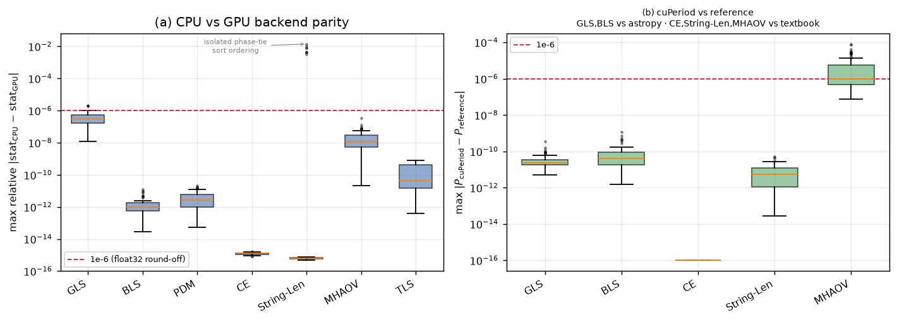
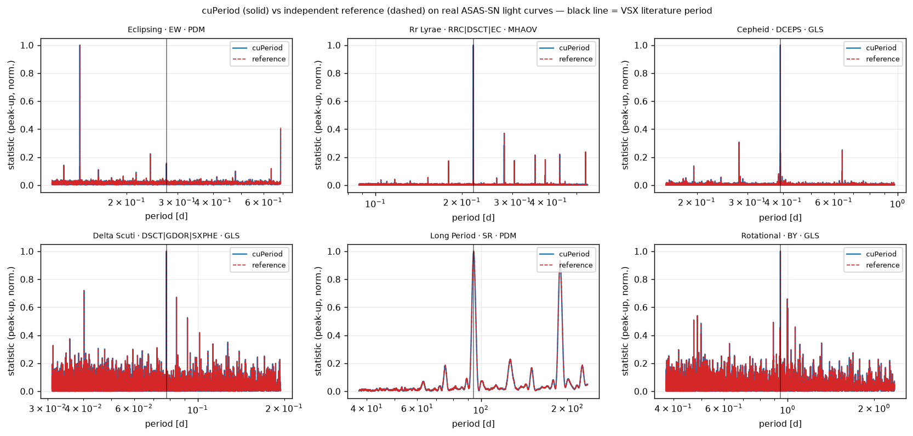
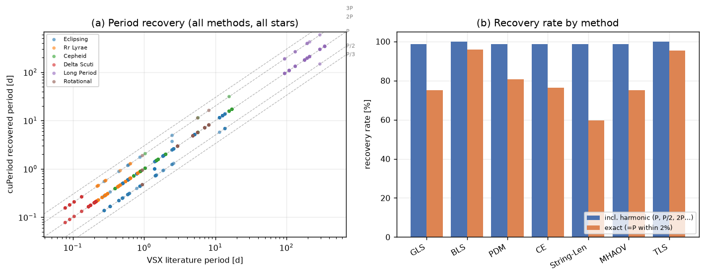
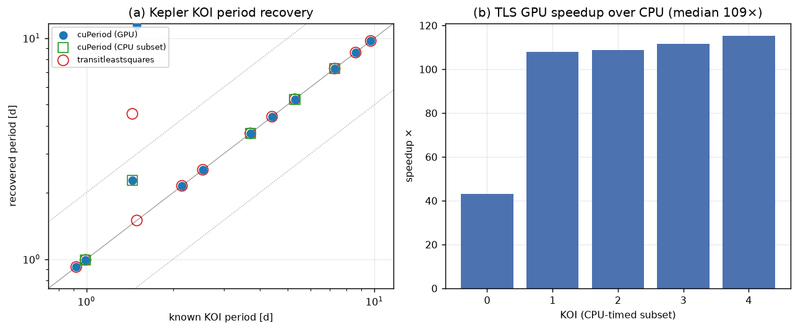
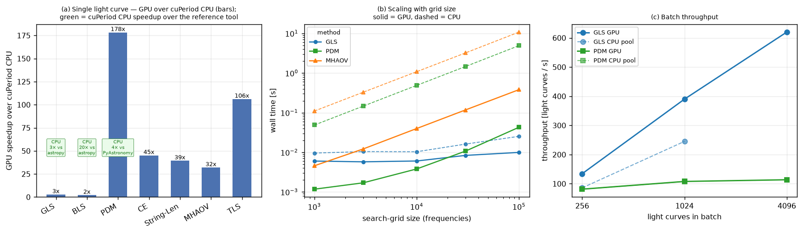

# cuPeriod — Validation & Benchmark Report

GPU: **NVIDIA RTX 5070 Ti** (compute capability 12.0, sm_120) · CPU backends: finufft / numpy / astropy · cuPeriod 0.1.0, CUDA 12, Python 3.12.

**Validation data** — 72 real ASAS-SN g-band light curves across 6 variability classes (eclipsing binaries, RR Lyrae, Cepheids, δ Scuti, long-period and rotational variables), each with a well-established VSX (AAVSO Variable Star Index) literature period. The curves and their literature periods ship with the suite in `dataset/light_curves.parquet` — the validation is fully reproducible with no external catalogue or network access. TLS is validated on confirmed Kepler KOIs (Mendeley *Dataset_Machine_Learning_Exoplanets_2024*; raw flux via MAST/lightkurve).

## 1 — Numerical validation (1-to-1)

Every method runs on an identical grid through cuPeriod's CPU and GPU backends and through an independent reference implementation. Two checks: **CPU↔GPU parity** (the two backends must agree to round-off) and **cuPeriod↔reference** (must match an established implementation).

| Method | N | parity | same | ref | refagree |
| --- | --- | --- | --- | --- | --- |
| GLS | 72 | 2.1e-06 | 100% | astropy LS | 3.4e-10 |
| BLS | 72 | 1.2e-11 | 100% | astropy BLS | 1.1e-09 |
| PDM | 72 | 2.1e-11 | 100% | PyAstronomy | r≥0.9484 |
| CE | 72 | 1.7e-15 | 100% | Graham 2013 | 0.0e+00 |
| String-Len | 72 | 1.4e-02 | 100% | Dworetsky 1983 | 5.2e-11 |
| MHAOV | 72 | 3.6e-07 | 100% | Sch.-Czerny | 8.0e-05 |
| TLS | 22 | 8.1e-10 | 100% | — | — |

*parity* = worst-case max relative \|stat_CPU − stat_GPU\| over all stars (GLS/MHAOV GPU paths are single precision, ≈1e-6/1e-7; the others are double). String-Length's looser parity is isolated trial frequencies where near-equal phases sort in a different order on the GPU — the recovered period is unaffected (*same* = 100%). *same* = fraction of stars where CPU and GPU pick the identical best period; *refagree* = worst-case max\|cuPeriod − reference\| on an identical grid (Pearson r for PDM, whose PyAstronomy reference uses a different θ normalisation).





## 2 — Period recovery on real light curves

| method | harmonic | exact |
| --- | --- | --- |
| GLS | 99% | 75% |
| BLS | 100% | 96% |
| PDM | 99% | 81% |
| CE | 99% | 76% |
| String-Len | 99% | 60% |
| MHAOV | 99% | 75% |
| TLS | 100% | 95% |

*harmonic* accepts the method-appropriate fold ambiguity (e.g. Fourier methods recover P/2 for contact binaries); *exact* requires the VSX literature period itself within 2%.



## 3 — TLS on Kepler transits

12 confirmed KOIs, blind search 0.5–12 d. cuPeriod (GPU) recovers the known period (or a 1/2 or 2× harmonic) within 2% for **83%** of them, and agrees with `transitleastsquares` on **83%**. On the 5-KOI CPU-timed subset, CPU↔GPU max\|Δpower\| ≤ 2.1e-14 and the GPU is a median **109×** faster.

| kepid | koi_period | cup_gpu_period | tls_ref_period | cup_gpu_relerr | cup_cpu_period | gpu_speedup |
| --- | --- | --- | --- | --- | --- | --- |
| 11673802 | 5.2879 | 5.2882 | 5.2883 | 4.7e-05 | 5.2882 | 43x |
| 12020329 | 7.2750 | 7.2741 | 7.2754 | 1.2e-04 | 7.2741 | 111x |
| 3458028 | 1.4426 | 2.2700 | 4.5411 | 2.1e-01 | 2.2700 | 108x |
| 5371777 | 0.9917 | 0.9916 | 0.9916 | 1.0e-04 | 0.9916 | 109x |
| 6291033 | 3.7060 | 3.7063 | 3.7058 | 8.8e-05 | 3.7063 | 115x |
| 6310636 | 0.9210 | 0.9210 | 0.9211 | 1.5e-05 | — | — |
| 6387542 | 2.5348 | 2.5346 | 2.5349 | 8.0e-05 | — | — |
| 7529266 | 8.6002 | 8.6000 | 8.5994 | 2.0e-05 | — | — |
| 7532973 | 2.1446 | 2.1446 | 2.1445 | 4.0e-07 | — | — |
| 7685981 | 4.4084 | 4.4082 | 4.4082 | 4.5e-05 | — | — |
| 8051946 | 1.4952 | 11.4480 | 1.4952 | 2.8e+00 | — | — |
| 9907129 | 9.7057 | 9.7068 | 9.7054 | 1.1e-04 | — | — |

*cuPeriod recovers 10/12; the `transitleastsquares` reference recovers 11/12. Both struggle only on the shallowest transits, where a blind 0.5–12 d search aliases — the honest failure mode, shared by the reference, not a backend defect.*




## 4 — Performance

**cuPeriod's CPU box search beats astropy.** The default CPU BLS backend is a multicore `numba` port of the CUDA kernel — **20× faster than astropy's compiled `BoxLeastSquares`** (187 ms vs 3.6 s on this light curve), matching it to floating-point — verified on all 72 validation light curves: max\|Δpower\| ≤ 1.1e-09, identical best period on 72/72. The GPU then adds another 2× (40× over astropy).

| method | cpu_backend | cpu_s | gpu_s | ref | ref_s | cpu_vs_ref | gpu_speedup |
| --- | --- | --- | --- | --- | --- | --- | --- |
| GLS | finufft | 0.019 | 0.0069 | astropy | 0.05 | 3x | 3x |
| BLS | numba | 0.187 | 0.0908 | astropy | 3.64 | 20x | 2x |
| PDM | numpy | 1.791 | 0.0100 | PyAstronomy | 6.96 | 4x | 178x |
| CE | numpy | 0.530 | 0.0118 | — | — | — | 45x |
| String-Len | numpy | 0.917 | 0.0233 | — | — | — | 39x |
| MHAOV | numpy | 3.555 | 0.1113 | — | — | — | 32x |
| TLS | numpy | 4.487 | 0.0423 | — | — | — | 106x |

*cpu_backend* = what `backend="cpu"` resolves to — the fast default a user gets: finufft (GLS), the multicore numba box search (BLS), numpy (the rest). *ref* = the established external tool; *cpu_vs_ref* = how much faster cuPeriod's CPU is than that tool; *gpu_speedup* = GPU over cuPeriod's CPU. cuPeriod's CPU path already beats every reference tool it has (GLS, PDM, BLS) — so the GPU's marginal gain is small where the CPU is already fast (BLS, GLS) and large where it is not (PDM, MHAOV, TLS).


> The pure-`numpy` BLS backend shares one array-module-generic source with the CUDA kernel (so they validate to floating-point), but it is a *parity reference*, not the product path — 18.6 s here, slower than numba and astropy because its GPU-shaped layout trades memory traffic for the parallelism that makes the GPU fast.



Batch throughput on one GPU peaks at **620 light curves/s** (GLS, n=4096) — **>2.2 million light curves/hour**. For these short (~900-point) curves on a small grid the per-curve work is tiny, so the GPU's edge over the CPU pool is modest (1.6× at n=1024, GLS); the GPU's decisive wins are the large-grid / many-point / box-and-fold cases in §4's single-curve and scaling results.

## Reproduce
The validation light curves ship in `dataset/light_curves.parquet`; no external data is needed for §1–2 and §4.
```
python benchmarks/validate_periodograms.py  # 1-1 validation (main GPU venv)
python benchmarks/benchmark.py              # performance
.venv-ref/.../python benchmarks/tls_download_ref.py   # Kepler + transitleastsquares
python benchmarks/tls_cuperiod.py           # cuPeriod TLS
python benchmarks/make_report.py            # this report
```
